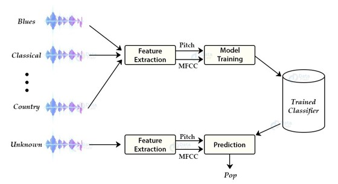

## Music Genre Classification

### Project Aim

The project aims to build a full-stack machine learning app with the purpose of classifying music into different genres.

The dataset used for training is the famous data set that contains 10 different popular genres [GTZAN](https://www.kaggle.com/datasets/andradaolteanu/gtzan-dataset-music-genre-classification)

### Method

#### Features

The following features are used for analysing, extracting and training audio signals:

- [zero crossing](https://en.wikipedia.org/wiki/Zero_crossing)
- [chroma stft](https://en.wikipedia.org/wiki/Chroma_feature)
- [spectral centroids](https://en.wikipedia.org/wiki/Spectral_centroid)
- [MFCC](https://en.wikipedia.org/wiki/Mel-frequency_cepstrum)

### Classifier

A simple K-Nearest Neighbor classificer is used due to its:

- Simplicity
- Performance with well-extracted features
- Performance with low-dimension dataset.
- No need for human-readable features and models

### Architecture

### Results
Music Genre Classification Using K-nearest neighbor model has an excellent training accuracy with ~99%. The model classified correctly 96% of observations on the test set. 